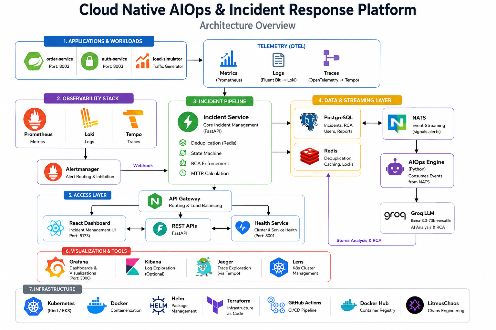
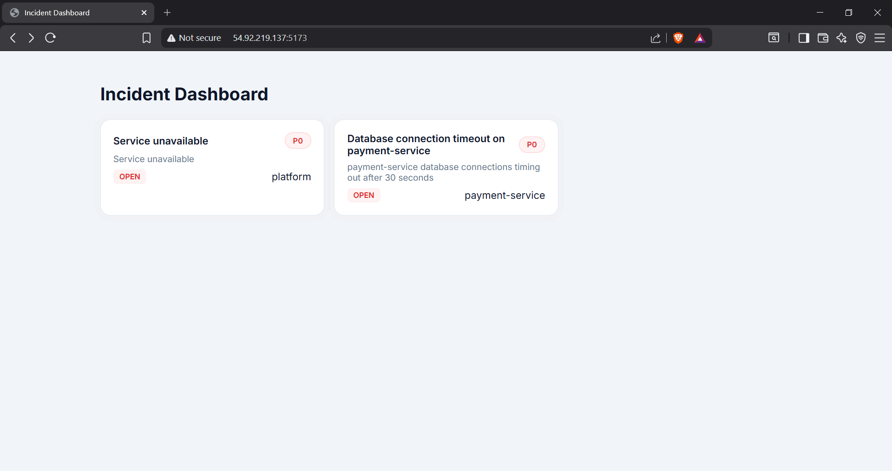
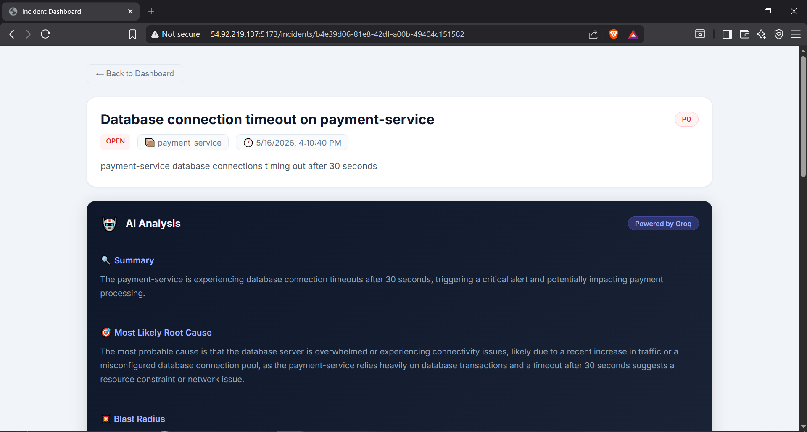
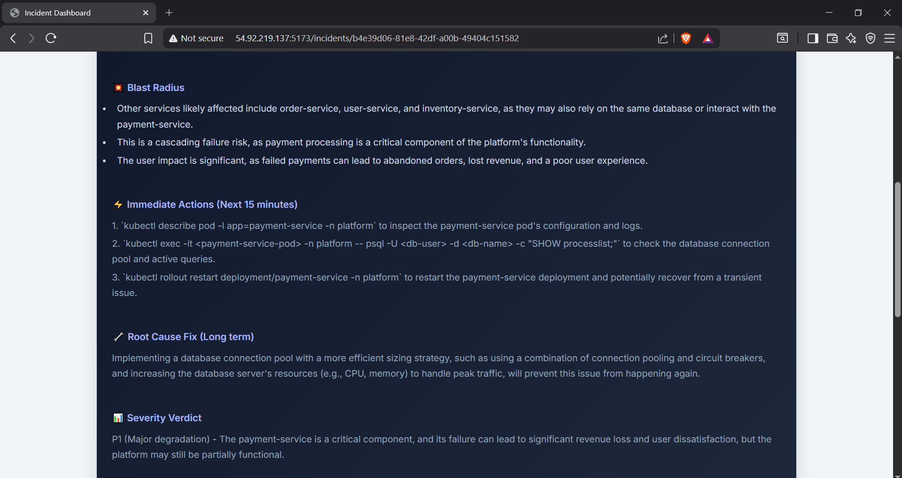
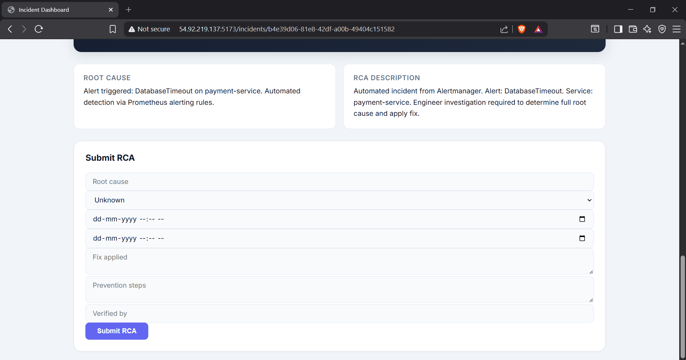
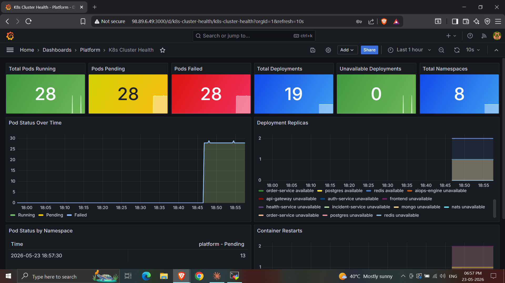

# Cloud Native AIOps & Incident Response Platform












> A production-grade SRE platform that automatically detects failures, creates incidents, and generates AI-powered root cause analysis — running on Kubernetes.

[](https://github.com/Dhruvpatil56/cloud-native-incident-platform/actions/workflows/platform-cicd.yml)
[](https://hub.docker.com/u/dhruvpatil56)

---

## What This Does

Most monitoring tools tell you something is broken. This platform tells you **what broke, why, and what to do** — automatically.

```
Prometheus detects anomaly
        ↓
Alertmanager fires webhook → Incident auto-created
        ↓
Raw signal streamed through NATS
        ↓
Groq LLM analyzes root cause in real time
        ↓
Engineer sees incident + AI analysis on dashboard
        ↓
OPEN → INVESTIGATING → RESOLVED → CLOSED
        ↓
RCA enforced · MTTR calculated automatically
```

---

## Tech Stack

| Layer         | Technology                                          |
| ------------- | --------------------------------------------------- |
| Services      | Python · FastAPI                                    |
| AI Analysis   | Groq LLM (llama-3.3-70b)                            |
| Databases     | PostgreSQL · Redis · MongoDB                        |
| Messaging     | NATS                                                |
| Observability | Prometheus · Grafana · Loki · Tempo · OpenTelemetry |
| Frontend      | React · TypeScript · Vite                           |
| Orchestration | Kubernetes (Kind / EKS)                             |
| CI/CD         | GitHub Actions                                      |
| IaC           | Terraform                                           |
| Chaos         | LitmusChaos                                         |

---

## Quick Start

### Docker Compose

```bash
git clone https://github.com/Dhruvpatil56/cloud-native-incident-platform.git
cd cloud-native-incident-platform

cp .env.example .env
# Set GROQ_API_KEY in .env

docker compose up -d
```

| Service      | URL                                 |
| ------------ | ----------------------------------- |
| Frontend     | http://localhost:5173               |
| Grafana      | http://localhost:3000 (admin/admin) |
| Prometheus   | http://localhost:9090               |
| Alertmanager | http://localhost:9093               |

### Kubernetes (Kind)

```bash
# Create cluster
kind create cluster --config kind-config.yaml

# Deploy full platform
bash startup.sh
```

---

## Demo

```bash
# Fire real incidents, run full lifecycle, show AI analysis
bash scripts/demo.sh
```

---

## CI/CD Pipeline

Every push to `main`:

```
Build & push Docker images to DockerHub
        ↓
Spin up ephemeral Kind cluster
        ↓
Deploy platform + run DB migration
        ↓
Fire synthetic incident via webhook
        ↓
Verify incident created ✅
        ↓
Tear down cluster
```

---

## Repository Structure

```
cloud-native-incident-platform/
├── services/               # All microservices
│   ├── incident-service/   # Core IMS (state machine · RCA · MTTR)
│   ├── aiops-engine/       # Groq AI analysis
│   ├── api-gateway/        # Central routing
│   ├── order-service/      # Sample microservice
│   ├── auth-service/       # Sample microservice
│   └── incident-service-ui/# React dashboard
├── observability/          # Prometheus · Grafana · Loki · Tempo · Alertmanager
├── infrastructure/
│   ├── kubernetes/         # K8s manifests
│   └── terraform/          # EKS · VPC · ECR
├── chaos/                  # LitmusChaos experiments
├── scripts/                # demo.sh · fire-incident.sh · cleanup.sh
├── docker-compose.yml      # Full local stack (24 services)
├── kind-config.yaml        # Kind cluster config
└── startup.sh              # Daily K8s bootstrap script
```

---

## Related

[Incident Management System](https://github.com/Dhruvpatil56/incident-management-system) — The core IMS engine this platform is built around. Standalone FastAPI service with token bucket rate limiting, Redis debouncing, ACID transactions, and state machine design pattern.


